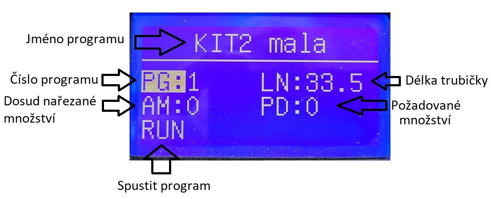

# TubeCutter
This is an arduino program that runs on a tube cutting machine.

## Postup při používání stroje

Program se ovládá pouze pomocí rotačního snímače, s ním se dá točit anebo jde stlačit. Otáčením snímače volím možnosti v menu, pokud chci možnost vybrat, snímač stlačím.

Nejdříve z menu vyberu číslo programu „PG:” (program) a otáčením snímače si nastavím program, který chci spustit (orientuji se podle názvu programu), stiskem snímače potvrdím volbu. Dále stejným způsobem nastavím požadované množství produkce „PD:” (production). Následně zvolím možnost „RUN“ a stisknu snímač, stroj začne řezat. Pokud chci stroj zastavit předčasně, stisknu snímač na možnosti „STOP“. Možnost „AM:” (amount) ukazuje, jaké množství se již nařezalo, před dalším spuštěním produkce se tento ukazatel musí vynulovat, výběrem této možnosti a stiskem snímače.

Při každém spuštění produkce, musím zkontrolovat prvních pár kusů, jestli sedí jejich délka. Pokud délka nesedí zastavím program a upravím možnost „LN:” (length), spustím program a znovu kontroluji délku. Nejlépe se kontrola provádí tak, že si ručně uříznu ideální délku trubičky, a přirovnám ji k právě uříznuté.

Když spustím produkci musím stále odvíjet roly trubičky, aby nekladla odpor posuvu stroje. Pokud role klade odpor anebo se úplně zasekne, řezané trubičky mají menší délku. 

U vstupu trubičky do stroje se kumuluje prach, při větším množství je potřeba ho odstranit.